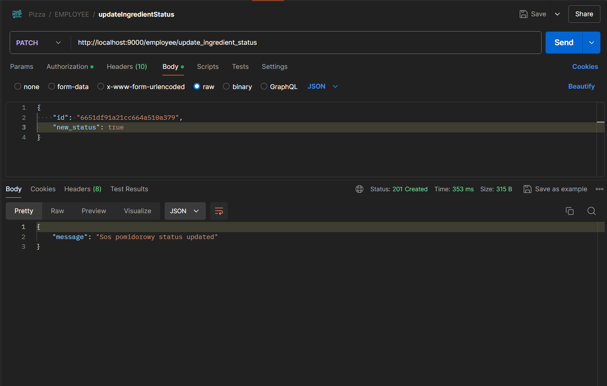
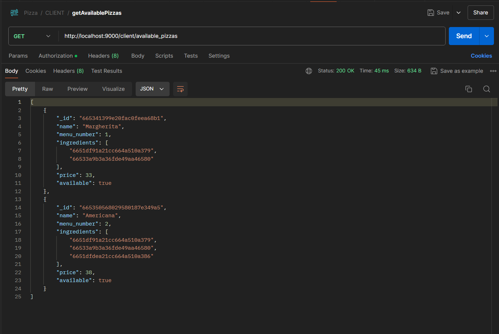
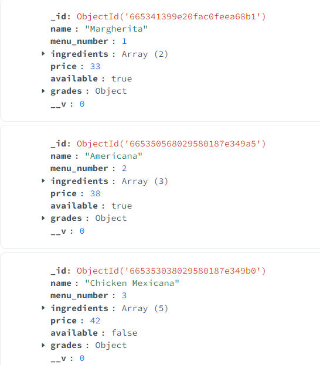
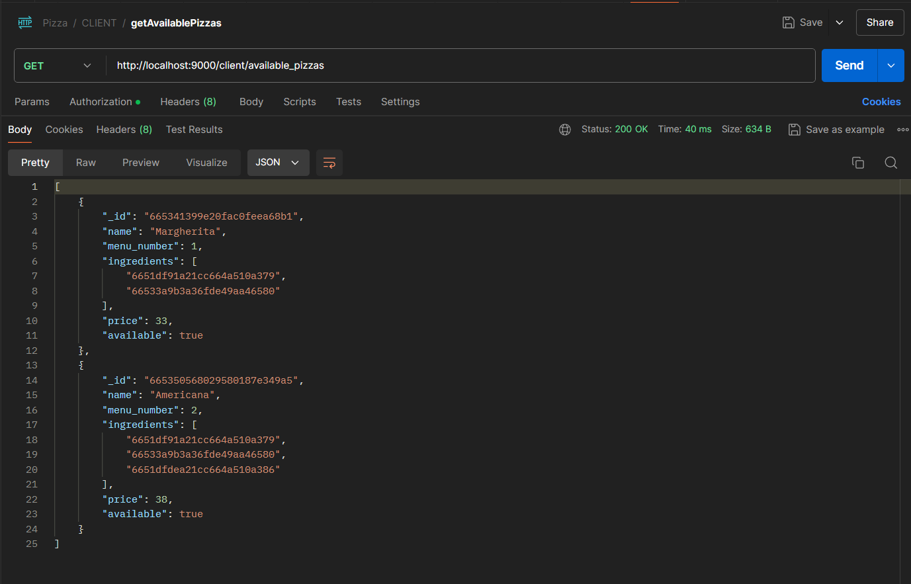

# BDPROJEKT_ALBINSKI_KONIOR
### Skład grupy
- Piotr Albiński
- Adam Konior
### Temat projektu
- Pizzeria
### Informację o wykorzystywanym SZBD i technologii realizacji projektu
- MongoDB
- Node.js

### Wstępne informacje:
- Korzystamy z frameworka Express oraz z mongoose
- Korzystamy z tokenów JWT do zablokowania nieautoryzowanego dostępu do zasobów naszej bazy.

### Statusy zamówienia:
- 0 - zamówienie wprowadzone do bazy, przypisany pracownik
- 1 - zamówienie przyjęte przez przypisanego pracownika
- -1 odrzucono zamówienie
- 2 Pizza w przygotowaniu, oczekiwanie na dostawcę, jeśli wybrano zamówienie z dostawą, w przeciwnym razie oczekiwanie na odbiór przez klienta
- 3.1 pizza odebrana przez dostawcę
- 3.2 pizza odebrana przez klienta
- 4 pizza dostarczona
- -4 problemy przy dostawie...

Oto nasz główny plik, który uruchamiany - app.js:
```js
const express = require('express');
const cors = require('cors');
const AdminRouter = require('./server/routers/AdminRouter.js');
const ClientRouter = require('./server/routers/ClientRouter.js');
const EmployeeRouter = require('./server/routers/EmployeeRouter');
const UserRouter = require('./server/routers/UserRouter');
const app = express();
const port = process.env.PORT || 9000;
const errorHandler = require("./server/middleware/errorHandler");
const dotenv = require('dotenv').config();
const connectDb = require('./server/config/db.Connection');
connectDb();


app.use(express.json());
app.use(express.urlencoded({ extended: true }));
app.use(cors());
app.use("/admin", AdminRouter);
app.use("/client", ClientRouter);
app.use("/employee", EmployeeRouter);
app.use("/user", UserRouter);
app.use(errorHandler); // do obsługi błędów na endpointach
app.listen(port, () => {
  console.log(`Server is running on http://localhost:${port}`);
});
```

errorHandler:
```js
const { constants } = require('../Constants');
const errorHandler = (err, req, res, next) => {
    const statusCode = res.statusCode ? res.statusCode : 500;
    switch(statusCode) {
        case constants.VALIDATION_ERROR:
            res.json({title: "Validation failed", message: err.message, stackTrace: err.stack}); 
            break;
        case constants.UNAUTHORIZED:
            res.json({title: "Unauthorized", message: err.message, stackTrace: err.stack}); 
            break;
        case constants.FORBIDDEN:
            res.json({title: "Forbidden", message: err.message, stackTrace: err.stack}); 
            break;
        case constants.NOT_FOUND:
            res.json({title: "Validation failed", message: err.message, stackTrace: err.stack}); 
            break;
        case constants.SERVER_ERROR:
            res.json({title: "Server error", message: err.message, stackTrace: err.stack}); 
            break;
        default:
            res.json({title: "Error", message: err.message, stackTrace: err.stack});
            break;
    }
}
module.exports = errorHandler; 
```

Oto nasze routery:
AdminRouter.js:
```js
const express = require("express");
const router = express.Router();
const { addPizza,
    addIngredient,
    addDiscount,
    registerWorker,
    createOrUpdateDeliveryPrice,
    bestRatedEmployees,
    mostBeneficialPizzasLastYear,
    mostGenerousClients
    } = require("../controllers/AdminController");
const validateToken = require("../middleware/validateToken");
const authorizeAdmin = require("../middleware/authorizeAdmin");

router.post("/add_pizza", validateToken, authorizeAdmin, addPizza);
router.post("/add_ingredient", validateToken, authorizeAdmin, addIngredient);
router.post("/add_discount", validateToken, authorizeAdmin, addDiscount);
router.post("/register_worker", validateToken, authorizeAdmin, registerWorker);
router.patch("/update_delivery_price", validateToken, authorizeAdmin, createOrUpdateDeliveryPrice);
router.get("/best_rated_employees", validateToken, authorizeAdmin, bestRatedEmployees);
router.get("/most_beneficial_pizzas_last_year", validateToken, authorizeAdmin, mostBeneficialPizzasLastYear);
router.get("/most_generous_clients", validateToken, authorizeAdmin, mostGenerousClients);

module.exports = router;
```

ClientRouter:
```js
const express = require("express");
const router = express.Router();

const { getAvailablePizzas,
  makeOrder,
  rateOrder,
  getOrderHistory } = require("../controllers/ClientController");

const validateToken = require("../middleware/validateToken");
const authorizeClient = require("../middleware/authorizeClient");

router.get("/available_pizzas", validateToken, authorizeClient, getAvailablePizzas);
router.post("/make_order", validateToken, authorizeClient, makeOrder);
router.patch("/rate_order", validateToken, authorizeClient, rateOrder);
router.get("/order_history", validateToken, authorizeClient, getOrderHistory);

module.exports = router;
```

EmployeeRouter:
```js
const express = require("express");
const router = express.Router();

const { updateIngredientStatus, 
  changeOrderStatus} = require("../controllers/EmployeeController");

const validateToken = require("../middleware/validateToken");
const authorizeWorker = require("../middleware/authorizeWorker");

router.patch("/update_ingredient_status", validateToken, authorizeWorker, updateIngredientStatus);
router.patch("/change_order_status", validateToken, authorizeWorker, changeOrderStatus);

module.exports = router;
```

UserRouter:
```js
const express = require('express');
const router = express.Router();
const {registerUser,
  loginUser,
  currentUser,
  deleteUser,
  changePassword} = require('../controllers/UserController');
const validateToken = require('../middleware/validateToken');


router.post('/register', registerUser);
router.post('/login', loginUser);
router.get('/current', validateToken, currentUser);
router.delete('/delete', validateToken, deleteUser);
router.patch('/change_password', validateToken, changePassword);

module.exports = router;
```

validateToken:
```js
const asyncHandler  = require('express-async-handler');
const jwt = require('jsonwebtoken');

const validateToken = asyncHandler(async (req, res, next) => {
    let token;
    let authHeader = req.headers.Authorization || req.headers.authorization;
    if (authHeader && authHeader.startsWith('Bearer')) {
        token = authHeader.split(' ')[1];
        jwt.verify(token, process.env.ACCESS_TOKEN_SECRET, (err, decoded) => {
            if (err) {
                res.status(401);
                throw new Error("Invalid token");
            }
            req.user = decoded.user;
            next();

        });
        if (!token) {
            res.status(401);
            throw new Error("Token is missing.");
        }
    }
    else {
        res.status(401);
        throw new Error("Invalid token");
    }
});

module.exports = validateToken;
```


### Schemat bazy

orders:
```js
const mongoose = require('mongoose');
const addressSchema = require('./Address');
const gradeSchema = require('./Grade');
const orderSchema = new mongoose.Schema({
    client_id: {
        type: mongoose.Schema.Types.ObjectId,
        ref: 'Clients',
        required: true
    },
    employee_id: {
        type: mongoose.Schema.Types.ObjectId,
        ref: 'Workers',
        required: true
    },
    deliverer_id: {
        type: mongoose.Schema.Types.ObjectId,
        ref: 'Workers',
        required: false
    },
    pizzas: [
        {
            pizza_id: {
                type: mongoose.Schema.Types.ObjectId,
                ref: 'Pizzas',
                required: true
            },
            current_price: { // cena pizzy może się zmieniać, więc tu zapisujemy cenę każdej zamówionej pizzy w momencie składania zamówienia
                type: Number,
                required: true
            },
            count: { 
                type: Number,
                required: true
            },
            discount: {
                type: Number,
                min: 0,
                max: 1,
                default: 0
            }
        }
    ],
    client_address: {
        type: addressSchema,
        required: true
    },
    order_notes: {
        type: String,
        required: false
    },
    order_date: {
        type: Date,
        required: true
    },
    grade : {
        type: gradeSchema,
        required: false
    },
    status: {
        type: String,
        required: true,
        enum: ['0', '1','-1', '2', '3.1', '3.2', '4', '-4']
    },
    to_deliver: {
        type: Boolean,
        required: true
    },
    total_price: { // można by teoretycznie obliczać to zawsze na podstawie pola pizzas, 
    //ale dodajemy tego typu redundantne pola, aby uprościć zapytania, z których korzysta klient, np. wyświetl historię zamówień
        with_discount: {
            type: Number,
            required: true
        },
        without_discount: {
            type: Number,
            required: true
        },
        delivery_price: { // wliczone w cenę with_discount i without_discount
            type: Number,
            required: true
        }
    },
    discount_id: { // można użyć tylko jednej zniżki na zamówienie. klient przy składaniu zamówienia decyduje, z której zniżki chce skorzystać
        type: mongoose.Schema.Types.ObjectId,
        required: false
    }
}, {timestamps: true});

module.exports = mongoose.model('Orders', orderSchema);
```

clients:
```js
const mongoose = require('mongoose');
const addressSchema = require('./Address');

const clientSchema = new mongoose.Schema({
    name: {
        type: String,
        required: true
    },
    phone: {
        type: String,
        required: true
    },
    address: {
        type: addressSchema,
        required: true
    },
    order_count: {
        type: Number,
        default: 0
    },
    discount_saved: { // ile klient zaoszczędził na zniżkach - kolejne teoretycznie redundantne pole, ale jego obliczenie byłoby dosyć skomplikowane i wydłużało by czas wykonywania zapytań przeznaczonych dla klienta.
        type: Number,
        default: 0
    },
    grades: { // oceny pizz przez klienta, nie zamówień tylko pizz
        type: [{ pizza_id: {
                    type: mongoose.Schema.Types.ObjectId,
                    ref: 'Pizzas',
                    required: true
                },
                stars: {
                    type: Number,
                    required: true}}],
        default: []
    }
});

module.exports = mongoose.model('Clients', clientSchema);
```

pizzas:
```js
const mongoose = require("mongoose");
const pizzaSchema = new mongoose.Schema({
    name: {
        type: String,
        required: true
    },
    menu_number: {
        type: Number,
        required: true
    },
    ingredients: {
        type:[{
            type: mongoose.Schema.Types.ObjectId,
            ref: 'Ingredients'
        }],
        default: []
    },
    price: {
        type: Number,
        required: true
    },
    available: { // pole aktualizowane podczas aktualizacji pola dostępności składnika w poniższej kolekcji ingredients
        type: Boolean,
        required: true
    },
    grades: {
        points_sum: { // suma ocen pizz
            type: Number,
            default: 0
        },
        grade_count: { // liczba ocen pizz
            type: Number,
            default: 0
        }
    }
});

module.exports = mongoose.model("Pizzas", pizzaSchema);
```

ingredients:
```js
const mongoose = require('mongoose');
const ingredientSchema = new mongoose.Schema({
    name: {
        type: String,
        required: true
    },
    vegan: {
        type: Boolean,
        required: true
    },
    vegetarian: {
        type: Boolean,
        required: true
    },
    available: {
        type: Boolean,
        required: true
    }
});

module.exports = mongoose.model('Ingredients', ingredientSchema);
```

workers:
```js
const mongoose = require('mongoose');
const addressSchema = require('./Address');
const workerSchema = new mongoose.Schema({
    name: {
        type: String,
        required: true
    },
    worker_type: { // employee(pracownik w kuchni) lub deliverer(dostawca)
        type: String,
        required: true
    },
    salary: {
        type: Number,
        required: true
    },
    phone: {
        type: String,
        required: true
    },
    address: {
        type: addressSchema,
        required: true
    },
    status: { // active lub inactive
        type: String,
        required: true
    },
    current_orders: {
        type: [{type: mongoose.Schema.Types.ObjectId, ref: 'Orders'}],
        default: []
    },
    orders_history: {
        type: [{type: mongoose.Schema.Types.ObjectId, ref: 'Orders'}],
        default: []
    }

});

workerSchema.index({current_orders: 1});
workerSchema.index({orders_history: 1});

module.exports = mongoose.model('Workers', workerSchema);
```

users: (połączone przez _id z clients i workers, w users istnieje też jedno konto admina)
```js
const mongoose = require('mongoose');
const userSchema = new mongoose.Schema({
    email: {
        type: String,
        required: true,
        unique: true
    },
    password: {
        type: String,
        required: true
    },
    role: {
        type: String,
        required: true
    }
}, {timestamps: true});

module.exports = mongoose.model('Users', userSchema);
```

gradeSchema:
```js
const mongoose = require('mongoose');
const gradeSchema = new mongoose.Schema({
    grade_food: {
        type: Number,
        min: 1,
        max: 6,
        required: true
    },
    grade_delivery: {
        type: Number,
        min: 1,
        max: 6,
        required: true
    },
    comment: {
        type: String,
        required: false,
        maxlength: 255
    }
});

module.exports = gradeSchema;
```

addressSchema:
```js
const mongoose = require('mongoose');
const addressSchema = new mongoose.Schema({
    city: {
        type: String,
        required: true
    },
    street: {
        type: String,
        required: true
    },
    district: {
        type: String,
        required: false
    },
    zip_code: {
        type: String,
        required: true
    }
});

module.exports = addressSchema;
```

### Dodatkowe operacje, które są proste i szybkie dzięki naszemu modelowi:
- wyświetlenie ile klient zaoszczędził na zniżkach
- wyświetlenie ile zamówień złożył dany klient
- wyświetlenie ocen, jakie wystawił dany klient
- sprawdzenie dostępności pizzy
- sprawdzenie obecnych zamówień przypisanych pracownikowi i jego historii zamówień


### Proste operacje CRUD - ten etap projektu wykonujemy na kolekcji users

### registerClient (create)
Tworzymy konto dla użytkownika w naszej bazie. Podajemy podstawowe potrzebne dane. Wykorzystujemy transakcję

```js
const registerClient = asyncHandler(async (req, res, next) => {
    const session = await mongoose.startSession();
    await session.startTransaction();
    try {
        const { email, name, password, role, phone, city, street, zip_code } = req.body;

        if (!name || !email || !password || !role || !phone || !city || !street || !zip_code) {
            throw new Error("Please fill in all fields");
        }

        const userAvailable = await User.findOne({ email }); // sprawdzamy czy istnieje użytkownik o podanym emailu
        if (userAvailable) {
            throw new Error("User already exists");
        }
        const hashedPassword = await bcrypt.hash(password, 10);
        const user = await User.create([{ //tworzymy użytkownika
            email,
            password: hashedPassword,
            role
        }], { session });
        if (user && role === "client") {
            const user_id = user[0]._id;
            const client = await Client.create([{ //tworzymy klienta
                _id: user_id,
                name,
                phone,
                address: { city, street, zip_code }
            }], { session });
            if (client) {
                await session.commitTransaction(); //użytkownik i klient poprawnie stworzeni, zatwierdzamy transakcję
                res.status(201).json({
                    _id: client[0].user_id,
                    name: client[0].name,
                    email: user[0].email,
                    phone: client[0].phone,
                    city: client[0].address.city,
                    street: client[0].address.street,
                    zip_code: client[0].address.zip_code
                });
            }
        } else {
            throw new Error("Invalid user data or role");
        }

    } catch (error) {
        res.status(400);
        await session.abortTransaction();
        next(error);
    } finally {
        await session.endSession();
    }
});

```


clients

users


### loginUser 
Logujemy użytkownika. Tworzymy klucz JWT potrzebny do dostępu dla innych endpointów.
```js
const loginUser = asyncHandler(async (req, res) => {
    const {email, password} = req.body;
    if(!email || !password){
        res.status(400);
        throw new Error("Please fill in all fields");
    }
    const user = await User.findOne({ email });
    if (user && (await bcrypt.compare(password, user.password))) {
        const accessToken = jwt.sign({user: {email: user.email, id: user.id, role: user.role}},
            process.env.ACCESS_TOKEN_SECRET, {expiresIn: "15m"});
        res.status(200).json({accessToken});
    }
    else {
        res.status(401);
        throw new Error("Invalid email or password");

    };
});
```


### deleteUser (delete)
Podobnie jak tworzyliśmy użytkownika, tutaj też potrzebujemy zastosować transakcję.
```js

const deleteUser = asyncHandler(async (req, res) => {
    const session = await mongoose.startSession();
    await session.startTransaction();
    try{
        const {email, password} = req.body;
        if(!email || !password){
            res.status(400);
            throw new Error("Please fill in all fields");
        }
        const user = await User.findOne({ email });
        if (user && (await bcrypt.compare(password, user.password))) {
            await User.deleteOne({email});
            await Client.deleteOne({_id: user.id});
            await session.commitTransaction();
            res.status(200).json({message: "User deleted"});
        }
        else {
            res.status(401);
            throw new Error("There is no user with this email or password is incorrect");

        }
    }
    catch (error) {
        await session.abortTransaction();
        next(error);
    } finally {
        await session.endSession();
    }
});
```


Po wykonaniu tej operacji ten użytkownik znika z obu kolekcji


### currentUser (read)
```js

const currentUser = asyncHandler(async (req, res) => {
    const {email, id, role} = req.user;
    if(role === "admin"){
        res.status(200).json({email, id, role});
    }
    else if(role === "client"){
        const client = await Client.findOne({_id: id});
        res.status(200).json({email, id, role, name: client.name,
        phone: client.phone, city: client.address.city, street: client.address.street});
    }
    else if(role === "worker"){
        const worker = await Worker.findOne({_id: id});
        res.status(200).json({email, id, role, name: worker.name,
        phone: worker.phone, city: worker.address.city, street: worker.address.street});
    }
    else {
        res.status(401);
        throw new Error("Invalid role");
    }
});
```


### changePassword (update)
```js
const changePassword = asyncHandler(async (req, res) => {
    const {email, id, role} = req.user;
    const {old_password, new_password} = req.body;
    if(!old_password || !new_password) {
        res.status(400);
        throw new Error("Please fill in all fields");
    }
    const user = await User.findOne({email});
    if (user && (await bcrypt.compare(old_password, user.password))) {
        const hashedPassword = await bcrypt.hash(new_password, 10);
        await User.updateOne({email}, {password: hashedPassword});
        res.status(200).json({email, message: "Password changed"});
    }
    else {
        res.status(401);
        throw new Error("Incorrect old password");
    }

});
```


po zmianie


### Operacje o charakterze transakcyjnym

Najbardziej znacząca:
```js
const changeOrderStatus = asyncHandler(async (req, res, next) => {
  const session = await mongoose.startSession();
  await session.startTransaction();
  try {
    const {new_status, order_id} = req.body;
    const orderId = new ObjectId(order_id);
    const order = await Order.findOne({_id: orderId}, null, {session});
    if (!order) {
      res.status(400);
      throw new Error("Order doesn't exist");
    }
    if (new_status === '1') { // oznacza zamówienie przyjęte
      if (order.status === '0') {
        await Order.updateOne({_id: orderId}, {status: new_status}, {session});
      } else {
        throw new Error(`Invalid new status. Current status is: ${order.status}`);
      }
    } else if (new_status === "2") { // oznacza pizza w przygotowaniu, jeśli zamówienie jest z dostawą, przypisujemy dostawcę
      if (order.status === "1") {
        if (order.to_deliver) {
          const deliverer = await findDeliverer(session.id); // przypisanie dostawcy
          if (deliverer) {
            await Order.updateOne({_id: orderId}, {status: new_status, deliverer_id: deliverer._id}, {session});
            await Worker.updateOne({_id: deliverer._id}, {$push: {current_orders: orderId}}, {session});
          }
        }
        else {
          await Order.updateOne({_id: orderId}, {status: new_status}, {session});
        }
      } else {
        throw new Error(`Invalid new status. Current status is: ${order.status}`);
      }
    } else if (new_status === '3.1') { // oznacza odebranie pizzy z pizzerii przez dostawcę
      if (!order.to_deliver) {
        throw new Error(`Invalid new status. Collection in person. This order's to_deliver is set to ${order.to_deliver}`);
      }
      if (order.status === "2") {
        await Order.updateOne({_id: orderId}, {status: new_status}, {session});
      } else {
        throw new Error(`Invalid new status. Current status is: ${order.status}`);
      }
    } else if (new_status === '3.2') { // oznacza odebranie pizzy przez klienta(zamówienie z odbiorem osobistym w restauracji)
      if (order.status === "2") {
        await Order.updateOne({_id: orderId}, {status: new_status}, {session});
        await Client.updateOne({_id: order.client_id}, {$inc: {order_count: 1}}, {session});
        await Worker.updateOne({_id: order.employee_id},
          {$pull: {current_orders: orderId}, $push: {orders_history: orderId}}, {session});

        const the_order = await Order.findOne({_id: orderId}, {total_price: 1, discount_id: 1}, {session});
        let saved_amount = the_order.total_price.without_discount - the_order.total_price.with_discount;
        saved_amount = parseFloat(saved_amount.toFixed(2));

        if (saved_amount > 0) {
          await Client.updateOne({_id: order.client_id}, {$inc: {discount_saved: saved_amount}}, {session});
        } // przypominam, że pole discount_saved w kolekcji clients oznacza, ile łącznie klient zaoszczędził na zniżkach
        if (the_order.discount_id) {
          await Discount.updateOne({_id: the_order.discount_id}, {$inc: {used_count: 1}}, {session});
        } // used_count oznacza, ile razy łącznie zniżka została wykorzystana
      } else {
        throw new Error(`Invalid new status. Current status is: ${order.status}`);
      }
    } else if (new_status === '-1') { // ozancza problem z wykonaniem zamówienia na etapie przygotowania pizzy
      await Order.updateOne({_id: orderId}, {status: new_status}, {session});
      await Worker.updateOne({_id: order.employee_id}, {
        $pull: {current_orders: orderId},
        $push: {orders_history: orderId}
      }, {session});
    } else if (new_status === '4') {
      if (order.status === "3.1") {
        await Order.updateOne({_id: orderId}, {status: new_status}, {session});
        await Client.updateOne({_id: order.client_id}, {$inc: {order_count: 1}}, {session});
        await Worker.updateMany({_id: {$in: [order.employee_id, order.deliverer_id]}},
          {$pull: {current_orders: orderId}, $push: {orders_history: orderId}}, {session});

        const the_order = await Order.findOne({_id: orderId}, {total_price: 1, discount_id: 1}, {session});
        let saved_amount = the_order.total_price.without_discount - the_order.total_price.with_discount;
        saved_amount = parseFloat(saved_amount.toFixed(2));
        if (saved_amount > 0) {
          await Client.updateOne({_id: order.client_id}, {$inc: {discount_saved: saved_amount}}, {session});
        }
        if (the_order.discount_id) {
          await Discount.updateOne({_id: the_order.discount_id}, {$inc: {used_count: 1}}, {session});
        }
      } else {
        throw new Error(`Invalid new status. Current status is: ${order.status}`);
      }
    }  else if (new_status === '-4') { // oznacza problem z wykonaniem zamówienia na etapie dostawy
      await Order.updateOne({_id: orderId}, {status: new_status}, {session});
      await Worker.updateMany({_id: {$in: [order.employee_id, order.deliverer_id]}},
          {$pull: {current_orders: orderId}, $push: {orders_history: orderId}}, {session});
    }
    await session.commitTransaction();
    res.status(201).json({message: `Order status set to ${new_status}`});
  }
  catch(err) {
    await session.abortTransaction();
    next(err);
  } finally {
    await session.endSession();
  }
});
```


registerWorker - dodajemy dokumenty do dwóch różnych kolekcji
```js
const registerWorker = asyncHandler(async (req, res, next) => {
  const session = await mongoose.startSession();
  await session.startTransaction();
  try {
    const { email, password, name, salary, phone, address, status, worker_type } = req.body;
    if (!email || !password || !name || !salary || !phone || !address || !status || !worker_type) {
      res.status(400);
      throw new Error("Please fill in all fields");
    }
    const hashedPassword = await bcrypt.hash(password, 10);
    await User.create([{
      email,
      password: hashedPassword,
      role: "worker"
    }], {session});
    await Worker.create([{
      name,
      worker_type,
      salary,
      phone,
      address,
      status
    }], {session});
    res.status(200).json({
      message: 'Worker registered',
      name,
      email,
      salary,
      phone,
      address,
      status,
      worker_type
    });
    await session.commitTransaction();
  } catch(err) {
    await session.abortTransaction();
    next(err);
  } finally {
    await session.endSession();
  }
});
```


makeOrder - dodajemy zamówienie do orders i do workers do pola current_orders
```js
const makeOrder = asyncHandler(async (req, res, next) => {
  const session = await mongoose.startSession();
  await session.startTransaction();
  try {
    const {email, id, role} = req.user;
    let { basket, order_date, order_notes, to_deliver, discount_id } = req.body; // basket: [{pizza_id: ObjectId, count: Number}, {pizza_id: ObjectId, count: Number}, ...]

    if (discount_id) {
      const the_discount = await Discount.findOne({_id: new ObjectId(discount_id)}, null, {session}); // sprawdzamy, czy podana zniżka istnieje

      if(!the_discount) {
        res.status(404);
        throw new Error("Discount not found");
      }
      const now = new Date();
      const available = isDateBetween(now, the_discount.start_date, the_discount.end_date);
      if (!available){
        throw new Error("Discount not available");
      }
      for (let basketPos of basket) {
        if (the_discount.pizza_ids.includes(basketPos.pizza_id)) {
          basketPos.discount = the_discount.value;
        }
        else {
          basketPos.discount = 0;
        }
      }

    } else {
      for (let basketPos of basket) {
        basketPos.discount = 0;
      }
    }
    const pizzas = await Pizza.find({_id : {$in: basket.map(item => item.pizza_id)}}, null, {session});
    for (let basketPos of basket) {
      let pizza = pizzas.find((item) => item._id.equals(basketPos.pizza_id));
      basketPos.current_price = pizza.price;
    }
    const vars = await AdminVars.findOne(null, null, {session});
    const {with_discount, without_discount} = await calculateTotalPrice(basket, to_deliver, vars.delivery_price);
    if (basket.length === 0) {
      res.status(400);
      throw new Error("We do not accept empty orders");
    }
    const employee = await findEmployee(session.id);
    await checkPizzasAvailability(basket, res, session.id);
    const clientData = await Client.findOne({_id: id},null, {session});
    let order_;
    if (discount_id) {
      order_ = await Order.create([
        {
          client_id: id,
          employee_id: employee._id,
          pizzas: basket,
          client_address: clientData.address,
          order_notes,
          order_date,
          status: '0',
          to_deliver,
          total_price: {with_discount, without_discount, delivery_price: to_deliver ? vars.delivery_price : 0},
          discount_id
        }
      ], { session });
    } else {
      order_ = await Order.create([
        {
          client_id: id,
          employee_id: employee._id,
          pizzas: basket,
          client_address: clientData.address,
          order_notes,
          order_date,
          status: '0',
          total_price: {with_discount, without_discount, delivery_price: to_deliver ? vars.delivery_price : 0},
          to_deliver,
          discount_id: null
        }
      ], { session });
    }

    const order = order_[0];
    await Worker.updateOne({_id: employee._id}, {$push: {current_orders: order.id}}, {session});
    await session.commitTransaction();
    res.status(200).json({
      order_id: order._id,
      message: "Order placed.",
      client_id: id,
      employee_id: employee._id,
      pizzas: basket,
      client_address: clientData.address,
      order_notes,
      order_date,
      total_price: {with_discount, without_discount, delivery_price: to_deliver ? vars.delivery_price : 0},
      discount_id
    });
  } catch (err) {
    await session.abortTransaction();
    next(err);
  } finally {
    await session.endSession();
  }
});
```

```js
function isDateBetween(dateToCheck, startDate, endDate) {
  return dateToCheck >= startDate && dateToCheck <= endDate;
}

function calculateTotalPrice(basket, to_deliver, delivery_price) {
  let priceWithDiscount = 0;
  let priceWithoutDiscount = 0;
  for (let basketPos of basket) {
    priceWithDiscount += basketPos.current_price * basketPos.count * (1-basketPos.discount);
    priceWithoutDiscount += basketPos.current_price * basketPos.count;
  }
  priceWithDiscount = parseFloat(priceWithDiscount.toFixed(2));
  return to_deliver ?
      { with_discount: priceWithDiscount + delivery_price, without_discount: priceWithoutDiscount + delivery_price } :
      { with_discount: priceWithDiscount, without_discount: priceWithoutDiscount };

}

async function findEmployee(sessionId) {


  const session = await mongoose.startSession({_id: sessionId});

  const employees = await Worker.find({worker_type: "employee", status: "active"}, null, { session });

  if (employees.length === 0) {
    throw new Error("There are no pizzaiolos available at the moment.");
  }
  const bestEmployee = employees.reduce((best, current) => {
    if (current.current_orders.length < best.current_orders.length) {
      return current;
    } else {
      return best;
    }
  }, employees[0]);
  return bestEmployee;
}

async function checkPizzasAvailability(basket, res, sessionId) {
  const session = await mongoose.startSession({_id: sessionId});
  const pizzaIds = basket.map(item => item.id);
  const pizzas = await Pizza.find({ _id: { $in: pizzaIds } },null,  {session});
  const unavailablePizzas = pizzas.filter(pizza => !pizza.available);

  if (unavailablePizzas.length > 0) {
    const unavailablePizzaNames = unavailablePizzas.map(pizza => pizza.name).join(', ');
    res.status(400);
    throw new Error(`Pizzas ${unavailablePizzaNames} aren't available. We can't make an order.`);
  }
}
```

```js
const deleteUser = asyncHandler(async (req, res) => {
    const session = await mongoose.startSession();
    await session.startTransaction();
    try{
        const {email, password} = req.body;
        if(!email || !password){
            res.status(400);
            throw new Error("Please fill in all fields");
        }
        const user = await User.findOne({ email }, { session });
        if (user && (await bcrypt.compare(password, user.password))) {
            await User.deleteOne({email});
            await Client.deleteOne({_id: user.id});
            await session.commitTransaction();
            res.status(200).json({email, message: "User deleted"});
        }
        else {
            res.status(401);
            throw new Error("There is no user with this email or password is incorrect");

        }
    }
    catch (error) {
        await session.abortTransaction();
        next(error);
    } finally {
        await session.endSession();
    }
});
```

updateIngredientStatus - nie tylko zmieniamy status obecności składnika na stanie, ale także ustawiamy odpowiednio pole available w pizzas, jeśli obecność lub nieobecność jakiegoś składnika powoduje, że już pizza jest dostępna lub niedostępna. 

```js
const updateIngredientStatus = asyncHandler(async (req, res, next) => {
  const session = await mongoose.startSession();
  await session.startTransaction();

  try {
    let { id, new_status } = req.body;
    id = new ObjectId(id);

    const the_ingredient = await Ingredient.findOne({_id: id});
    if (!the_ingredient) {
      res.status(400);
      throw new Error("Ingredient doesn't exist");
    }

    // aktualizujemy składnik
    await Ingredient.updateOne({_id: id}, {available: new_status}, { session });
    const pizzasWithIngredient = await Pizza.aggregate([
      { $match: { ingredients: id } },
    ], { session });

    // szukamy pizz, które zawierają ten składnik i aktualizujemy ich pole "available"
    for (const pizza of pizzasWithIngredient) {
      let allOtherIngredientsAvailable = true;

      if (new_status){ // tylko jeśli chcemy zmienić dostępność na true, jeśli zmieniamy na false, pomijamy
        const otherIngredients = pizza.ingredients.filter(ingredient_id => !ingredient_id.equals(id));

        allOtherIngredientsAvailable = await Ingredient.countDocuments(
            { _id: { $in: otherIngredients }, available: true },
            { session }
        ) === otherIngredients.length;
      }
      // jeśli new_status na false, po prostu wszystkim pizzom ustawiamy available na false. 
      // w przeciwnym wypadku sprawdzamy to co wyżej, czyli czy wszystkie składniki mają available na true
      if (allOtherIngredientsAvailable) {
        await Pizza.updateOne(
            { _id: pizza._id },
            { $set: { available: new_status } },
            { session }
        );
      }
    }
    await session.commitTransaction();
    res.status(201).json({message: `${the_ingredient.name} status updated`});
  } catch(err) {
    await session.abortTransaction();
    next(err);
  } finally {
    await session.endSession();
  }
});
```


(Obie pizze zawierają Sos pomidorowy)






### Operacje o charakterze raportującym

### Pozostałe operacje

### addIngredient (dodanie nowego składnika pizzy do bazy)

```js
const addIngredient = asyncHandler(async (req, res, next) => {
  try {
    const {name, vegan, vegetarian, available} = req.body;
    const existingIngredient = await Ingredient.findOne({name: name});
    if (existingIngredient) {
      res.status(400);
      throw new Error("Ingredient already exists");
    }
    await Ingredient.create({
      name,
      vegan,
      vegetarian,
      available
    });

    res.status(200).json({
      message: 'Ingredient saved',
      name,
      vegan,
      vegetarian,
      available
    })
  } catch(err) {
    next(err);
  }
});
```


A gdy spróbuję ponownie zrobić to samo:

i cebula się nie dodała drugi raz.


### addPizza (dodanie nowej pizzy do bazy)

```js
const addPizza = asyncHandler(async (req, res, next) => {
  try {
    const {name, ingredients, price, available} = req.body;
    const existingPizzaWithName = await Pizza.findOne({name: name});
    if (existingPizzaWithName) {
      res.status(400);
      throw new Error("There is already a pizza with this name");
    }
    const ingredients_ObjId = ingredients.map((ingredient) => new ObjectId(ingredient))
    const existingPizzaWithIngredients = await Pizza.aggregate([
      {
        $project: {
          isSameIngredients: { $setEquals: ["$ingredients", ingredients_ObjId] }
        }
      },
      {
        $match: {
          isSameIngredients: true
        }
      }
    ]);
    if (existingPizzaWithIngredients.length > 0) {
      res.status(400);
      throw new Error("There is already a pizza with this set of ingredients");
    }
    // sprawdzamy, czy wszystkie składniki, które zostały podane, istnieją w bazie w następujący sposób
    // 1) szukamy w bazie wszystkich składników, które zostały podane
    // 2) zliczamy ilość znalezionych w bazie składników
    // 3) sprawdzamy, czy znaleźliśmy tyle składników ile zostało podane(zakładamy, że nie mamy w bazie dwóch składników o tym samym ingredient_nr)
    const ingredientsExist = await Ingredient.aggregate([
      {
        $match: { _id: { $in: ingredients_ObjId } }
      },
      {
        $group: {
          _id: null,
          matchedIngredientsCount: { $sum: 1 }
        }
      },
      {
        $project: {
          ingredientsExist: { $eq: ["$matchedIngredientsCount", ingredients_ObjId.length] }
        }
      },
      {
        $match: {
          ingredientsExist: true
        }
      }
    ]);
    if (ingredientsExist.length === 0) {
      throw new Error("At least one of the given ingredients doesn't exist");
    }
    const next_menu_number_query = await Pizza.aggregate([
      {
        $sort: { menu_number: -1 }
      },
      {
        $limit: 1
      }
    ]);
    const next_menu_number = next_menu_number_query.length > 0 ? next_menu_number_query[0].menu_number + 1 : 1;
    await Pizza.create({
      name,
      menu_number: next_menu_number,
      ingredients: ingredients_ObjId,
      price,
      available
    });

    res.status(200).json({
      message: "Pizza saved",
      name,
      ingredients_ObjId,
      price,
      available
    })
  } catch(err) {
    next(err);
  }
});
```


Teraz przetestujmy po kolei obsługę błędów:


### addDiscount (dodanie nowej zniżki do bazy)

```js
const addDiscount = asyncHandler(async (req, res, next) => {
  try {
    const {name, pizza_ids, value, start_date, end_date} = req.body;

    // walidacja
    const existingName = await Discount.findOne({name: name});
    if (existingName) {
      res.status(400);
      throw new Error("Discount name already exists");
    }

    // sprawdzenie, czy pizze, dla których chcemy zastosować zniżkę, istnieją(robione analogicznie jak w funkcji wyżej, addPizza)
    const pizza_idsExist = await Pizza.aggregate([
      {
        $match: { menu_number: { $in: pizza_ids } }
      },
      {
        $group: {
          _id: null,
          matchedPizzasCount: { $sum: 1 }
        }
      },
      {
        $project: {
          pizzasExist: { $eq: ["$matchedPizzasCount", pizza_ids.length] }
        }
      },
      {
        $match: {
          pizzasExist: true
        }
      }
    ]);
    if (pizza_idsExist.length === 0) {
      res.status(400);
      throw new Error("At least one of the given pizzas doesn't exist");
    }

    // sprawdzenie poprawności wartości zniżki
    if (value > 1 || value < 0) {
      res.status(400);
      throw new Error("Invalid discount value");
    }

    // sprawdzenie poprawności dat
    const start_date_DATE = new Date(start_date).toISOString();
    const end_date_DATE = new Date(end_date).toISOString();
    if (end_date_DATE < start_date_DATE) {
      res.status(400);
      throw new Error("Invalid dates");
    }

    // dodanie zniżki
    await Discount.create({
      name,
      pizza_ids,
      value,
      start_date: start_date_DATE,
      end_date: end_date_DATE
    });
    res.status(200).json({
      message: "Discount saved",
      name,
      pizza_ids,
      value,
      start_date,
      end_date
    })
  } catch(err) {
    next(err);
  }
});
```


Teraz przetestujmy obłsugę błędów:


### registerEmployee (rejestrowanie pracownika przez admina)

#### Użycie transakcji
Używamy transakcji, ponieważ wstawiamy dane do dwóch różnych kolekcji.

```js
const registerEmployee = asyncHandler(async (req, res, next) => {
  const session = await mongoose.startSession();
  await session.startTransaction();
  try {
    const { email, password, name, salary, phone, address, status } = req.body;
    if (!email || !password || !name || !salary || !phone || !address || !status) {
      res.status(400);
      throw new Error("Please fill in all fields");
    }
    const hashedPassword = await bcrypt.hash(password, 10);
    await User.create([{
      email,
      password: hashedPassword,
      role: "employee"
    }], {session});
    await Worker.create([{
      name,
      salary,
      phone,
      address,
      status
    }], {session});
    res.status(200).json({
      message: 'Employee registered',
      name,
      email,
      salary,
      phone,
      address,
      status
    });
    await session.commitTransaction();
  } catch(err) {
    await session.abortTransaction();
    next(err);
  } finally {
    await session.endSession();
  }
});
```


### getAvailablePizzas (pobranie pizz, które są aktualnie dostępne)

```js
const getAvailablePizzas = asyncHandler(async (req, res, next) => {
  try {
    const pizzas = await Pizza.find({available: true}, 'name menu_number ingredients price available');
    res.status(200).json(pizzas);
  } catch (err) {
    next(err);
  }
});
```





