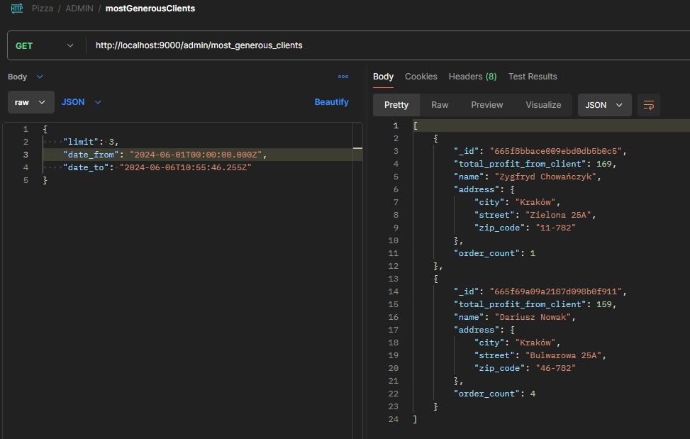
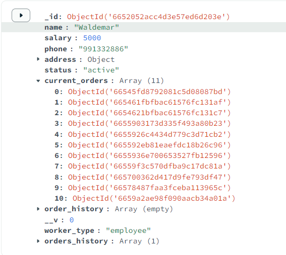
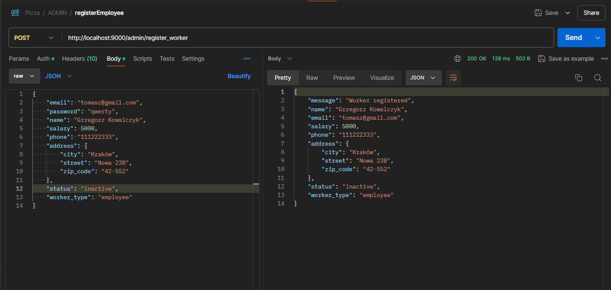
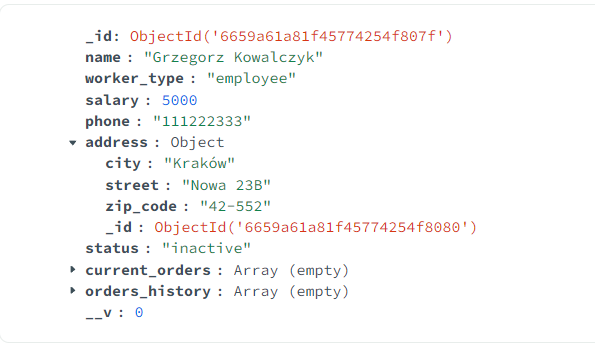
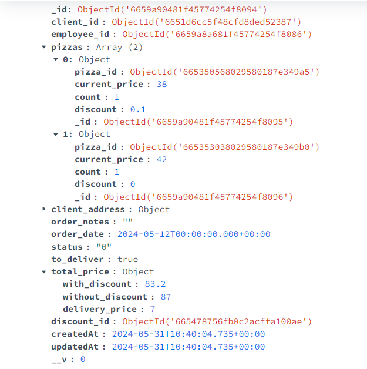
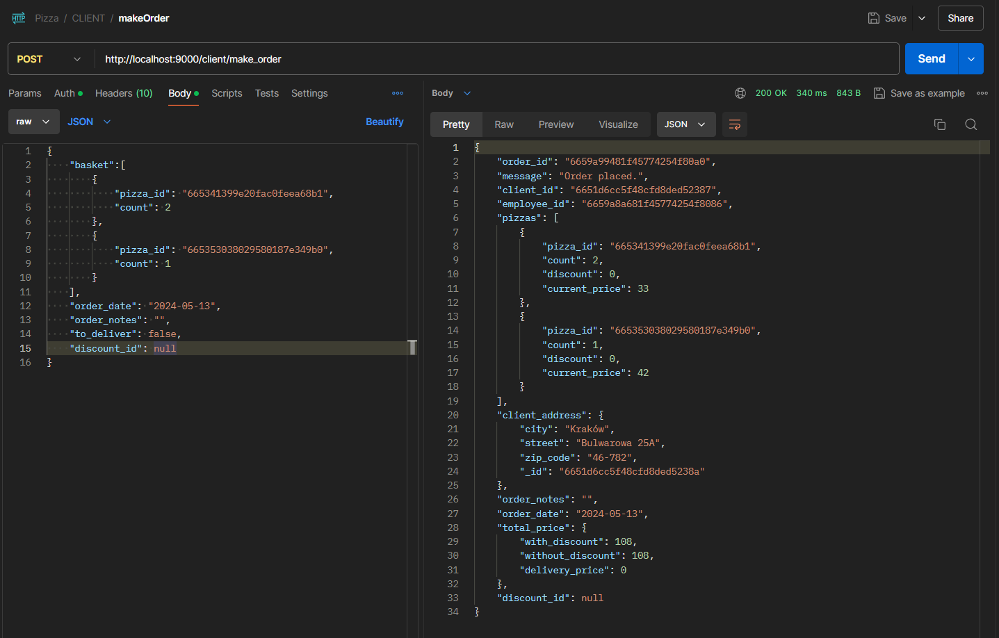

# BDPROJEKT_ALBINSKI_KONIOR
### Skład grupy
- Piotr Albiński
- Adam Konior
### Temat projektu
- Pizzeria
### Informację o wykorzystywanym SZBD i technologii realizacji projektu
- MongoDB
- Node.js


### Tworzenie schematu bazy danych:
| Action | Query Type | Information | Frequency | Priority |
|:-:|--|:-:|:-:|:-|
| dodanie rezerwacji stolika | create/update | client, table_id |  100 rez. dziennie| high |
| dodanie zamówienia pizzy (odbiór lub dostawa) | create | client | 1000 zamówiń dziennie | high |
|  |  |  |  |  |
|  |  | This is a long value | but why? |  |
|  |  |  |  |  |
|  |  |  | Here is something |  |
|  |  |  |  |  |
### Co często będziemy robić w naszej bazie:
- tworzyć zamówienia, rezerwacje 

### proste operacje CRUD
- administrator zarządza aktualnym menu (dodanie, odczytanie (tutaj bardziej klient) modyfikacja, usunięcie pizzy)
### Create

### jakieś operacje o charakterze transakcyjnym (np. zakup, rezerwacja, wypożyczenie, kontrola zasobów itp.)


### Endpoints

### Controllers


### Przykładowe operacje CRUD
### registerClient (create)
Tworzymy konto dla użytkownika w naszej bazie. Podajemy podstawowe potrzebne dane. Wykorzystujemy transakcję

```js
const registerClient = asyncHandler(async (req, res, next) => {
    const session = await mongoose.startSession();
    await session.startTransaction();
    try {
        const { email, name, password, role, phone, city, street, zip_code } = req.body;

        if (!name || !email || !password || !role || !phone || !city || !street || !zip_code) {
            throw new Error("Please fill in all fields");
        }

        const userAvailable = await User.findOne({ email }); // sprawdzamy czy istnieje użytkownik o podanym emailu
        if (userAvailable) {
            throw new Error("User already exists");
        }
        const hashedPassword = await bcrypt.hash(password, 10);
        const user = await User.create([{ //tworzymy użytkownika
            email,
            password: hashedPassword,
            role
        }], { session });
        if (user && role === "client") {
            const user_id = user[0]._id;
            const client = await Client.create([{ //tworzymy klienta
                _id: user_id,
                name,
                phone,
                address: { city, street, zip_code }
            }], { session });
            if (client) {
                await session.commitTransaction(); //użytkownik i klient poprawnie stworzeni, zatwierdzamy transakcję
                res.status(201).json({
                    _id: client[0].user_id,
                    name: client[0].name,
                    email: user[0].email,
                    phone: client[0].phone,
                    city: client[0].address.city,
                    street: client[0].address.street,
                    zip_code: client[0].address.zip_code
                });
            }
        } else {
            throw new Error("Invalid user data or role");
        }

    } catch (error) {
        res.status(400);
        await session.abortTransaction();
        next(error);
    } finally {
        await session.endSession();
    }
});

```


clients

users


### loginUser 
Logujemy użytkownika. Tworzymy klucz JWT potrzebny do dostępu dla innych endpointów.
```js
const loginUser = asyncHandler(async (req, res) => {
    const {email, password} = req.body;
    if(!email || !password){
        res.status(400);
        throw new Error("Please fill in all fields");
    }
    const user = await User.findOne({ email });
    if (user && (await bcrypt.compare(password, user.password))) {
        const accessToken = jwt.sign({user: {email: user.email, id: user.id, role: user.role}},
            process.env.ACCESS_TOKEN_SECRET, {expiresIn: "15m"});
        res.status(200).json({accessToken});
    }
    else {
        res.status(401);
        throw new Error("Invalid email or password");

    };
});
```


### deleteUser (delete)
Podobnie jak tworzyliśmy użytkownika, tutaj też potrzebujemy zastosować transakcję.
```js

const deleteUser = asyncHandler(async (req, res) => {
    const session = await mongoose.startSession();
    await session.startTransaction();
    try{
        const {email, password} = req.body;
        if(!email || !password){
            res.status(400);
            throw new Error("Please fill in all fields");
        }
        const user = await User.findOne({ email });
        if (user && (await bcrypt.compare(password, user.password))) {
            await User.deleteOne({email});
            await Client.deleteOne({_id: user.id});
            await session.commitTransaction();
            res.status(200).json({message: "User deleted"});
        }
        else {
            res.status(401);
            throw new Error("There is no user with this email or password is incorrect");

        }
    }
    catch (error) {
        await session.abortTransaction();
        next(error);
    } finally {
        await session.endSession();
    }
});
```


Po wykonaniu tej operacji ten użytkownik znika z obu kolekcji


### currentUser (read)
```js

const currentUser = asyncHandler(async (req, res) => {
    const {email, id, role} = req.user;
    if(role === "admin"){
        res.status(200).json({email, id, role});
    }
    else if(role === "client"){
        const client = await Client.findOne({_id: id});
        res.status(200).json({email, id, role, name: client.name,
        phone: client.phone, city: client.address.city, street: client.address.street});
    }
    else if(role === "worker"){
        const worker = await Worker.findOne({_id: id});
        res.status(200).json({email, id, role, name: worker.name,
        phone: worker.phone, city: worker.address.city, street: worker.address.street});
    }
    else {
        res.status(401);
        throw new Error("Invalid role");
    }
});
```





### changePassword (update)
```js
const changePassword = asyncHandler(async (req, res) => {
    const {email, id, role} = req.user;
    const {old_password, new_password} = req.body;
    if(!old_password || !new_password) {
        res.status(400);
        throw new Error("Please fill in all fields");
    }
    const user = await User.findOne({email});
    if (user && (await bcrypt.compare(old_password, user.password))) {
        const hashedPassword = await bcrypt.hash(new_password, 10);
        await User.updateOne({email}, {password: hashedPassword});
        res.status(200).json({email, message: "Password changed"});
    }
    else {
        res.status(401);
        throw new Error("Incorrect old password");
    }

});
```




po zmianie
