# BDPROJEKT_ALBINSKI_KONIOR
### Skład grupy
- Piotr Albiński
- Adam Konior
### Temat projektu
- Pizzeria
### Informację o wykorzystywanym SZBD i technologii realizacji projektu
- MongoDB
- Node.js


### Tworzenie schematu bazy danych:
| Action | Query Type | Information | Frequency | Priority |
|:-:|--|:-:|:-:|:-|
| dodanie rezerwacji stolika | create/update | client, table_id |  100 rez. dziennie| high |
| dodanie zamówienia pizzy (odbiór lub dostawa) | create | client | 1000 zamówiń dziennie | high |
|  |  |  |  |  |
|  |  | This is a long value | but why? |  |
|  |  |  |  |  |
|  |  |  | Here is something |  |
|  |  |  |  |  |
### Co często będziemy robić w naszej bazie:
- tworzyć zamówienia, rezerwacje 

### proste operacje CRUD
- administrator zarządza aktualnym menu (dodanie, odczytanie (tutaj bardziej klient) modyfikacja, usunięcie pizzy)
### Create

### jakieś operacje o charakterze transakcyjnym (np. zakup, rezerwacja, wypożyczenie, kontrola zasobów itp.)


### Endpoints

### Controllers


### Przykładowe operacje CRUD
### registerClient (create)
Tworzymy konto dla użytkownika w naszej bazie. Podajemy podstawowe potrzebne dane. Wykorzystujemy transakcję

```js
const registerClient = asyncHandler(async (req, res, next) => {
    const session = await mongoose.startSession();
    await session.startTransaction();
    try {
        const { email, name, password, role, phone, city, street, zip_code } = req.body;

        if (!name || !email || !password || !role || !phone || !city || !street || !zip_code) {
            throw new Error("Please fill in all fields");
        }

        const userAvailable = await User.findOne({ email }); // sprawdzamy czy istnieje użytkownik o podanym emailu
        if (userAvailable) {
            throw new Error("User already exists");
        }
        const hashedPassword = await bcrypt.hash(password, 10);
        const user = await User.create([{ //tworzymy użytkownika
            email,
            password: hashedPassword,
            role
        }], { session });
        if (user && role === "client") {
            const user_id = user[0]._id;
            const client = await Client.create([{ //tworzymy klienta
                _id: user_id,
                name,
                phone,
                address: { city, street, zip_code }
            }], { session });
            if (client) {
                await session.commitTransaction(); //użytkownik i klient poprawnie stworzeni, zatwierdzamy transakcję
                res.status(201).json({
                    _id: client[0].user_id,
                    name: client[0].name,
                    email: user[0].email,
                    phone: client[0].phone,
                    city: client[0].address.city,
                    street: client[0].address.street,
                    zip_code: client[0].address.zip_code
                });
            }
        } else {
            throw new Error("Invalid user data or role");
        }

    } catch (error) {
        res.status(400);
        await session.abortTransaction();
        next(error);
    } finally {
        await session.endSession();
    }
});

```


clients

users


### loginUser 
Logujemy użytkownika. Tworzymy klucz JWT potrzebny do dostępu dla innych endpointów.
```js
const loginUser = asyncHandler(async (req, res) => {
    const {email, password} = req.body;
    if(!email || !password){
        res.status(400);
        throw new Error("Please fill in all fields");
    }
    const user = await User.findOne({ email });
    if (user && (await bcrypt.compare(password, user.password))) {
        const accessToken = jwt.sign({user: {email: user.email, id: user.id, role: user.role}},
            process.env.ACCESS_TOKEN_SECRET, {expiresIn: "15m"});
        res.status(200).json({accessToken});
    }
    else {
        res.status(401);
        throw new Error("Invalid email or password");

    };
});
```


### deleteUser (delete)
Podobnie jak tworzyliśmy użytkownika, tutaj też potrzebujemy zastosować transakcję.
```js

const deleteUser = asyncHandler(async (req, res) => {
    const session = await mongoose.startSession();
    await session.startTransaction();
    try{
        const {email, password} = req.body;
        if(!email || !password){
            res.status(400);
            throw new Error("Please fill in all fields");
        }
        const user = await User.findOne({ email });
        if (user && (await bcrypt.compare(password, user.password))) {
            await User.deleteOne({email});
            await Client.deleteOne({_id: user.id});
            await session.commitTransaction();
            res.status(200).json({message: "User deleted"});
        }
        else {
            res.status(401);
            throw new Error("There is no user with this email or password is incorrect");

        }
    }
    catch (error) {
        await session.abortTransaction();
        next(error);
    } finally {
        await session.endSession();
    }
});
```


Po wykonaniu tej operacji ten użytkownik znika z obu kolekcji


### currentUser (read)
```js

const currentUser = asyncHandler(async (req, res) => {
    const {email, id, role} = req.user;
    if(role === "admin"){
        res.status(200).json({email, id, role});
    }
    else if(role === "client"){
        const client = await Client.findOne({_id: id});
        res.status(200).json({email, id, role, name: client.name,
        phone: client.phone, city: client.address.city, street: client.address.street});
    }
    else if(role === "worker"){
        const worker = await Worker.findOne({_id: id});
        res.status(200).json({email, id, role, name: worker.name,
        phone: worker.phone, city: worker.address.city, street: worker.address.street});
    }
    else {
        res.status(401);
        throw new Error("Invalid role");
    }
});
```


### changePassword (update)
```js
const changePassword = asyncHandler(async (req, res) => {
    const {email, id, role} = req.user;
    const {old_password, new_password} = req.body;
    if(!old_password || !new_password) {
        res.status(400);
        throw new Error("Please fill in all fields");
    }
    const user = await User.findOne({email});
    if (user && (await bcrypt.compare(old_password, user.password))) {
        const hashedPassword = await bcrypt.hash(new_password, 10);
        await User.updateOne({email}, {password: hashedPassword});
        res.status(200).json({email, message: "Password changed"});
    }
    else {
        res.status(401);
        throw new Error("Incorrect old password");
    }

});
```


po zmianie
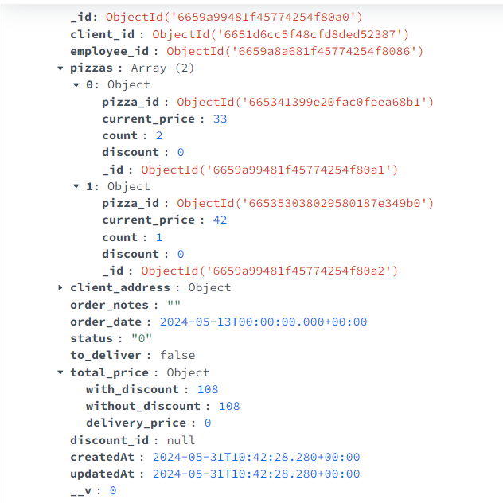


### addIngredient (dodanie nowego składnika pizzy do bazy)

#### Użycie transakcji
Używamy transakcji, ponieważ admin mógłby w tym samym momencie próbować dodać dwa składniki, co skutkowałoby dodaniem dwóch składników o tym samym ingredient_nr(choć teoretycznie jest jeden admin, więc to nie powinno się wydarzyć)

```js
const addIngredient = asyncHandler(async (req, res, next) => {
  const session = await mongoose.startSession();

  // otwarcie transakcji
  await session.startTransaction();

  try {
    const {name, vegan, vegetarian, available} = req.body;

    // walidacja
    const existingIngredient = await Ingredient.findOne({name: name}, null, { session });
    if (existingIngredient) {
      res.status(400);
      throw new Error("Ingredient already exists");
    }

    // nadanie kolejnego ingredient_nr w bazie na podstawie obecnych
    const next_ingredient_nr_query = await Ingredient.aggregate([
      {
        $sort: { ingredient_nr: -1 }
      },
      {
        $limit: 1
      }
    ]).session(session);
    const next_ingredient_nr = next_ingredient_nr_query.length > 0 ? next_ingredient_nr_query[0].ingredient_nr + 1 : 1;

    // dodanie składnika do bazy
    await Ingredient.create([{
      ingredient_nr: next_ingredient_nr,
      name,
      vegan,
      vegetarian,
      available
    }], { session });

    // zatwierdzenie transakcji
    await session.commitTransaction();
    res.status(200).json({
      message: 'Ingredient saved',
      name,
      vegan,
      vegetarian,
      available
    })
  } catch(err) {
    // odrzucenie transakcji w razie błędu
    await session.abortTransaction();
    next(err);
  } finally {
    await session.endSession();
  }
});
```


A gdy spróbuję ponownie zrobić to samo:
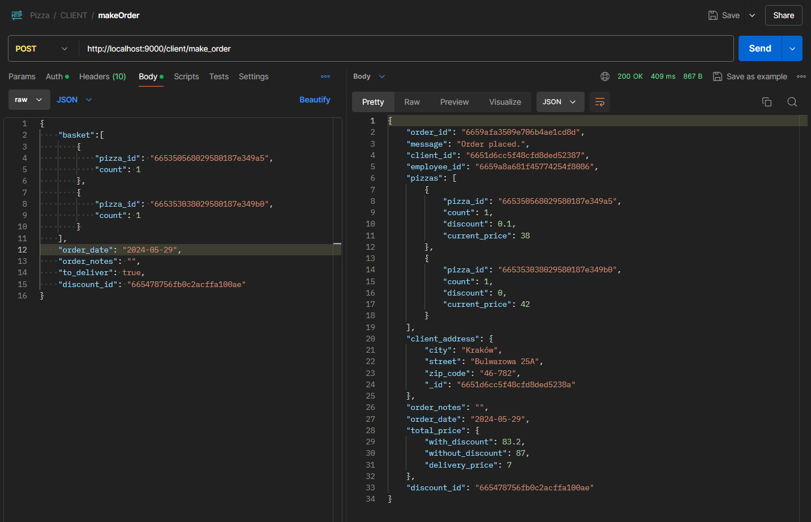
i papryka się nie dodała drugi raz.

### addPizza (dodanie nowej pizzy do bazy)

#### Użycie transakcji
Używamy transakcji analogicznie jak wyżej, ale tym razem dodajemy pizzę, a nie składnik

```js
const addPizza = asyncHandler(async (req, res, next) => {
  const session = await mongoose.startSession();

  //otwarcie transakcji
  await session.startTransaction();
  try {
    const {name, ingredients, price, available} = req.body;

    //walidacja
    const existingPizzaWithName = await Pizza.findOne({name: name}, null, {session});
    if (existingPizzaWithName) {
      res.status(400);
      throw new Error("There is already a pizza with this name");
    }
    const existingPizzaWithIngredients = await Pizza.aggregate([
      {
        $project: {
          isSameIngredients: { $setEquals: ["$ingredients", ingredients] }
        }
      },
      {
        $match: {
          isSameIngredients: true
        }
      }
    ], {session});
    if (existingPizzaWithIngredients.length > 0) {
      res.status(400);
      throw new Error("There is already a pizza with this set of ingredients");
    }

    // sprawdzamy, czy wszystkie składniki, które zostały podane, istnieją w bazie w następujący sposób
    // 1) szukamy w bazie wszystkich składników, które zostały podane
    // 2) zliczamy ilość znalezionych w bazie składników
    // 3) sprawdzamy, czy znaleźliśmy tyle składników ile jest w bazie(zakładamy, że nie mamy w bazie dwóch składników o tym samym ingredient_nr, zapewniamy to przez przetwarzanie transakcyjne przy dodawaniu nowego składnika)
    const ingredientsExist = await Ingredient.aggregate([
      {
        $match: { ingredient_nr: { $in: ingredients } }
      },
      {
        $group: {
          _id: null,
          matchedIngredientsCount: { $sum: 1 }
        }
      },
      {
        $project: {
          ingredientsExist: { $eq: ["$matchedIngredientsCount", ingredients.length] }
        }
      },
      {
        $match: {
          ingredientsExist: true
        }
      }
    ], {session});
    if (ingredientsExist.length === 0) {
      throw new Error("At least one of the given ingredients doesn't exist");
    }

    // obliczamy nowy menu_number dla pizzy
    const next_menu_number_query = await Pizza.aggregate([
      {
        $sort: { menu_number: -1 }
      },
      {
        $limit: 1
      }
    ], {session});
    const next_menu_number = next_menu_number_query.length > 0 ? next_menu_number_query[0].menu_number + 1 : 1;
    
    // dodajemy pizzę
    await Pizza.create([{
      name,
      menu_number: next_menu_number,
      ingredients,
      price,
      available
    }], {session});

    await session.commitTransaction();
    res.status(200).json({
      message: "Pizza saved",
      name,
      ingredients,
      price,
      available
    })
  } catch(err) {
    await session.abortTransaction();
    next(err);
  } finally {
    await session.endSession();
  }
});
```
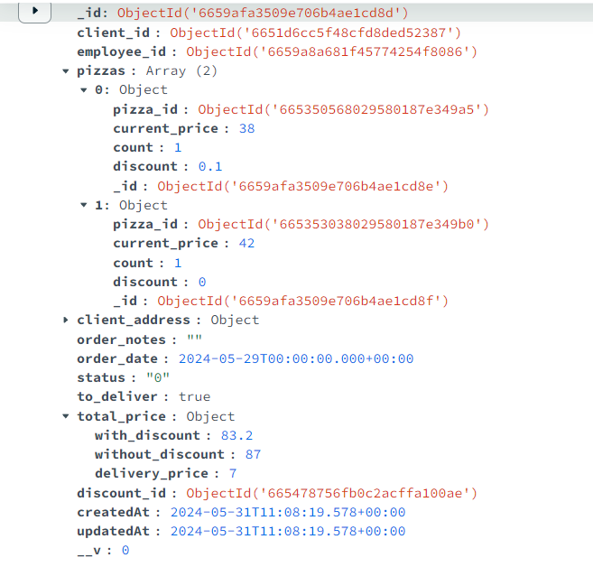
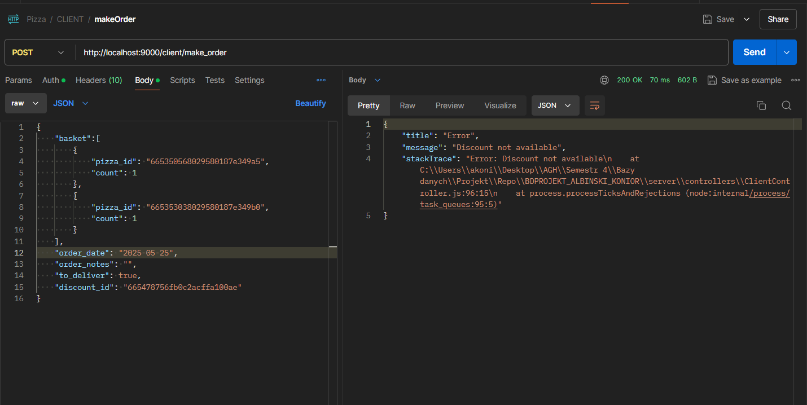

Teraz przetestujmy po kolei obsługę błędów:

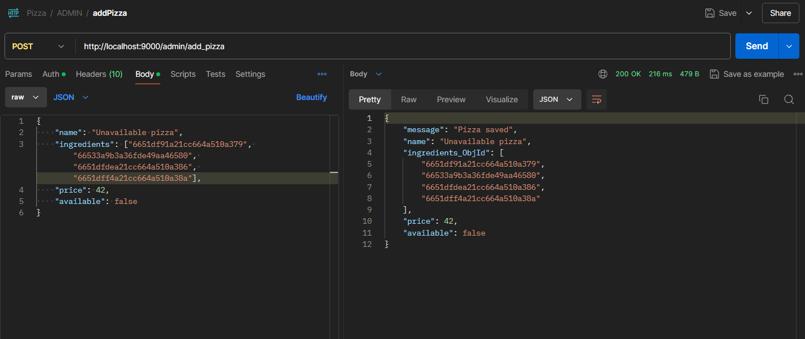
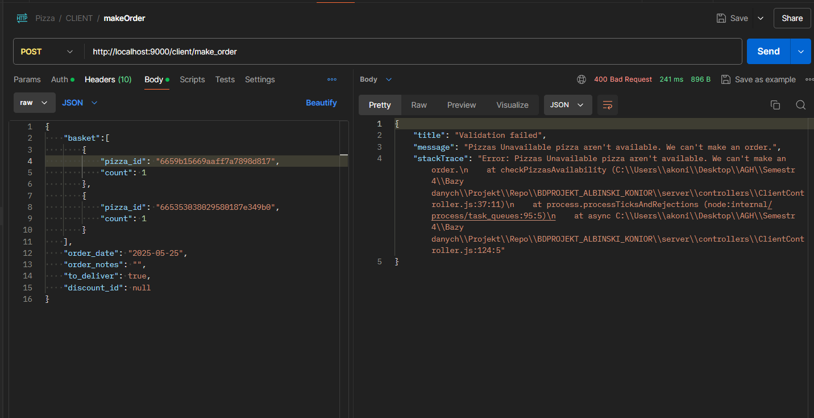


### addDiscount (dodanie nowej zniżki do bazy)

```js
const addDiscount = asyncHandler(async (req, res, next) => {
  try {
    const {name, pizza_ids, value, start_date, end_date} = req.body;

    // walidacja
    const existingName = await Discount.findOne({name: name});
    if (existingName) {
      res.status(400);
      throw new Error("Discount name already exists");
    }

    // sprawdzenie, czy pizze, dla których chcemy zastosować zniżkę, istnieją(robione analogicznie jak w funkcji wyżej, addPizza)
    const pizza_idsExist = await Pizza.aggregate([
      {
        $match: { menu_number: { $in: pizza_ids } }
      },
      {
        $group: {
          _id: null,
          matchedPizzasCount: { $sum: 1 }
        }
      },
      {
        $project: {
          pizzasExist: { $eq: ["$matchedPizzasCount", pizza_ids.length] }
        }
      },
      {
        $match: {
          pizzasExist: true
        }
      }
    ]);
    if (pizza_idsExist.length === 0) {
      res.status(400);
      throw new Error("At least one of the given pizzas doesn't exist");
    }

    // sprawdzenie poprawności wartości zniżki
    if (value > 1 || value < 0) {
      res.status(400);
      throw new Error("Invalid discount value");
    }

    // sprawdzenie poprawności dat
    const start_date_DATE = new Date(start_date).toISOString();
    const end_date_DATE = new Date(end_date).toISOString();
    if (end_date_DATE < start_date_DATE) {
      res.status(400);
      throw new Error("Invalid dates");
    }

    // dodanie zniżki
    await Discount.create({
      name,
      pizza_ids,
      value,
      start_date: start_date_DATE,
      end_date: end_date_DATE
    });
    res.status(200).json({
      message: "Discount saved",
      name,
      pizza_ids,
      value,
      start_date,
      end_date
    })
  } catch(err) {
    next(err);
  }
});
```

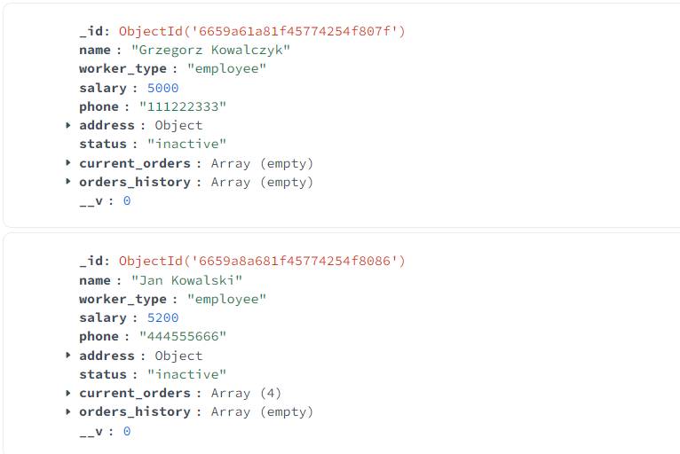
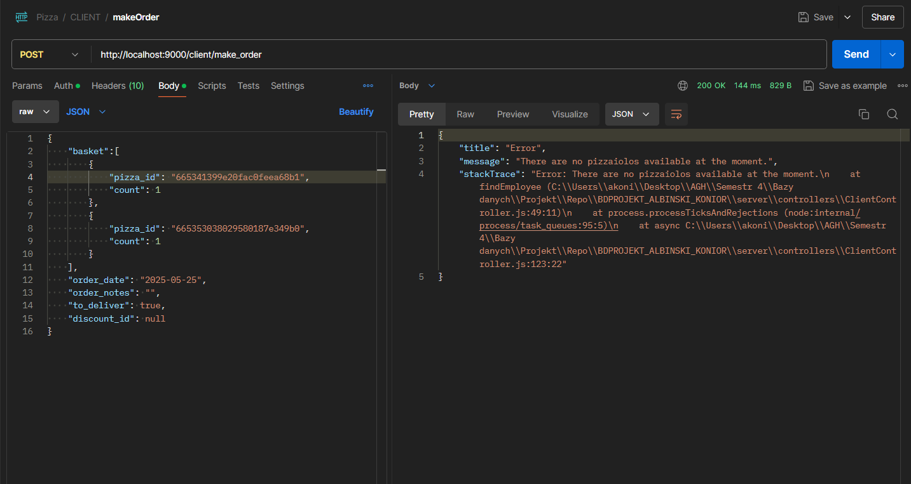
Teraz przetestujmy obłsugę błędów:
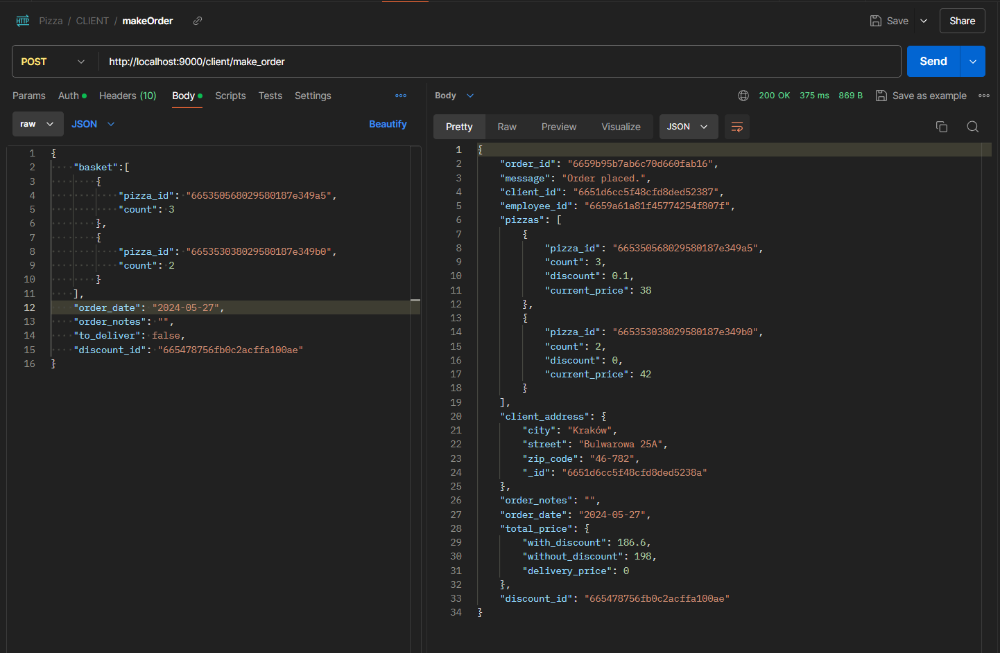

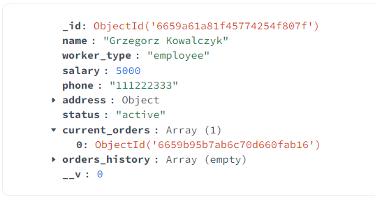


### registerEmployee (rejestrowanie pracownika przez admina)

#### Użycie transakcji
Używamy transakcji, ponieważ wstawiamy dane do dwóch różnych kolekcji.

```js
const registerEmployee = asyncHandler(async (req, res, next) => {
  const session = await mongoose.startSession();
  await session.startTransaction();
  try {
    const { email, password, name, salary, phone, address, status } = req.body;
    if (!email || !password || !name || !salary || !phone || !address || !status) {
      res.status(400);
      throw new Error("Please fill in all fields");
    }
    const hashedPassword = await bcrypt.hash(password, 10);
    await User.create([{
      email,
      password: hashedPassword,
      role: "employee"
    }], {session});
    await Worker.create([{
      name,
      salary,
      phone,
      address,
      status
    }], {session});
    res.status(200).json({
      message: 'Employee registered',
      name,
      email,
      salary,
      phone,
      address,
      status
    });
    await session.commitTransaction();
  } catch(err) {
    await session.abortTransaction();
    next(err);
  } finally {
    await session.endSession();
  }
});
```

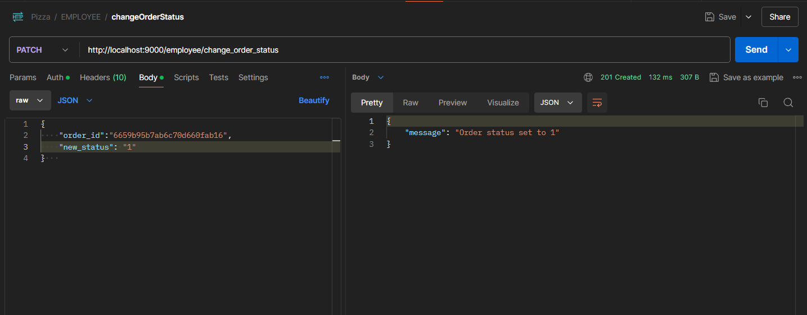
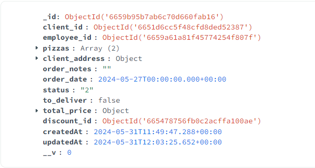
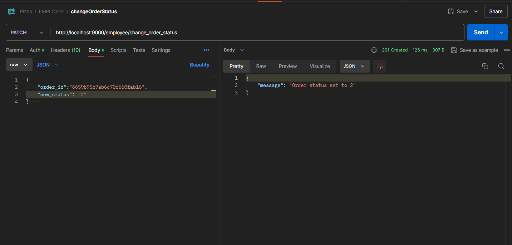

### getAvailablePizzas (pobranie pizz, do których w danym momencie są dostępne składniki)

#### Trochę bardziej złożone zapytanie, pobierające dane z dwóch kolekcji, raportujące

```js
const getAvailablePizzas = asyncHandler(async (req, res, next) => {
  try {
    const pizzas = await Pizza.aggregate([
      {
        $lookup: {
          from: "ingredients",
          localField: "ingredients", // pole ingredients w Pizza to pole przechowujące tablicę numerów składników
          foreignField: "ingredient_nr",
          as: "ingredientsDetails"
        }
      },
      {
        $addFields: {
          availableIngredients: {
            $filter: {
              input: "$ingredientsDetails",
              as: "ingredient",
              cond: { $eq: ["$$ingredient.available", true] }
            }
          }
        }
      },
      {
        $match: {
          $expr: { $eq: [{ $size: "$availableIngredients" }, { $size: "$ingredientsDetails" }] }
        }
      },
      {
        $project: {
          menu_number: 1,
          name: 1,
          price: 1,
          ingredients: 1,
          available: 1
        }
      }
    ]);
    res.status(200).json(pizzas);
  } catch (error) {
    next(error);
  }
});
```
Przetestujmy:
Proszę zwrócić uwagę na dostępność składników i składniki w pizzach
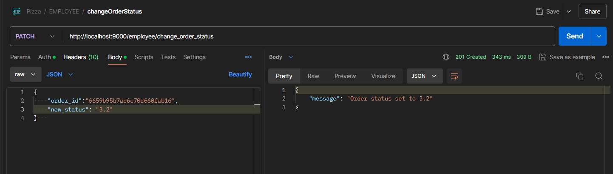

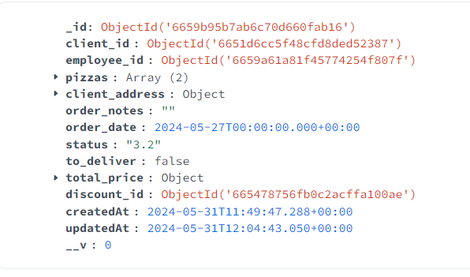
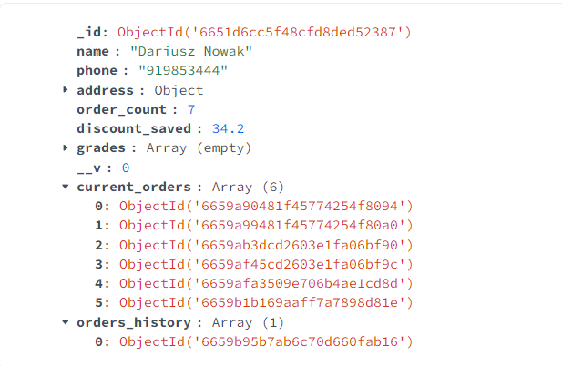


### updateIngredientStatus (aktualizacja dostępności składnika)

```js
const updateIngredientStatus = asyncHandler(async (req, res, next) => {
  try {
    const { name, new_status } = req.body;
    const the_ingredient = await Ingredient.findOne({name: name});
    if (!the_ingredient) {
      res.status(400);
      throw new Error("Ingredient doesn't exist");
    }
    await Ingredient.updateOne({name: name}, {available: new_status});
    res.status(201).json({
      message: 'Ingredient status updated',
      name,
      new_status
    });
  } catch(err) {
    next(err);
  }
});
```

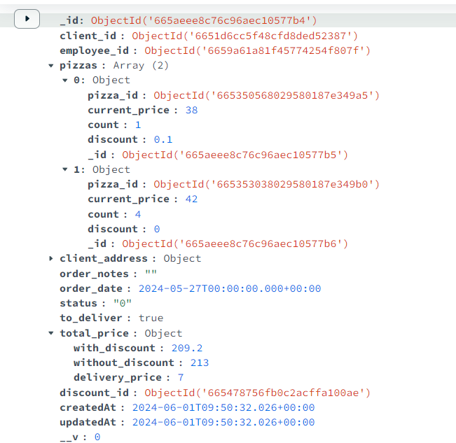
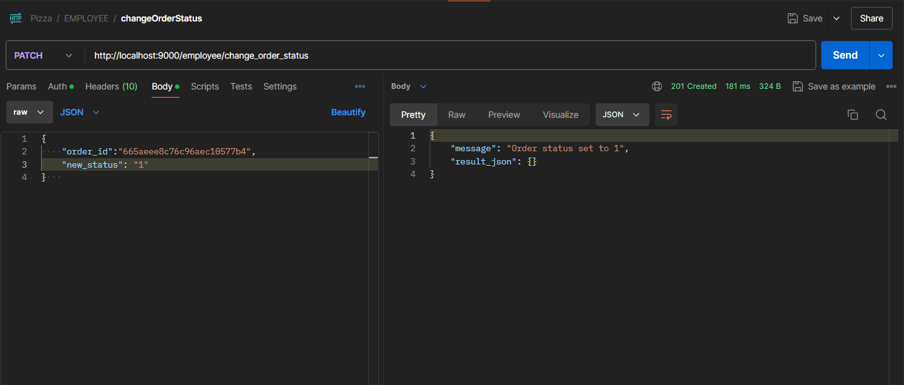
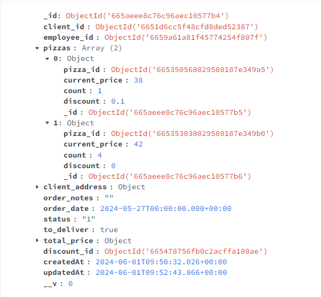
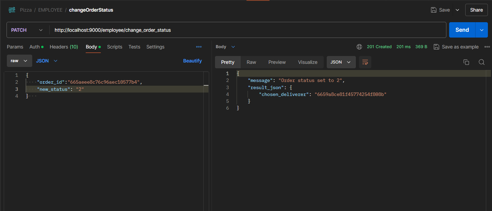